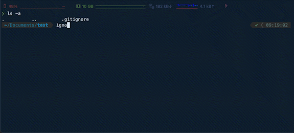

# Ignofier

A Cli that allows you to easily make gitignore files

## Installing
```
$ npm install -g ignofier
```
or
```
$ npm install --location=global ignofier
```

## Usage


## License
This package is licensed under MIT License